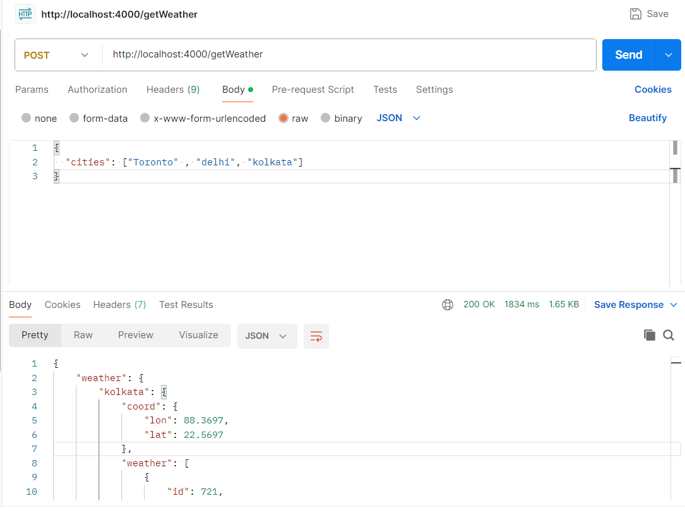
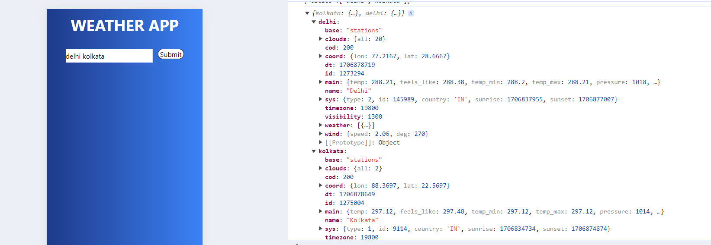

# Weather App

## Installation

1. Clone the repository:

   ```bash
   git clone https://github.com/Aman-s12354/weather.git


 2. Add you own API_KEY in env file
   


# Express Weather API

## Overview

The Express Weather API is a simple Node.js application that provides real-time weather information for multiple cities. It is built using the Express.js framework and integrates with weather APIs to fetch accurate weather data.

## Features

- Accepts names of multiple cities as input.
- Fetches real-time weather data from external weather APIs.
- Provides an easy-to-use endpoint for retrieving weather information.
- 

